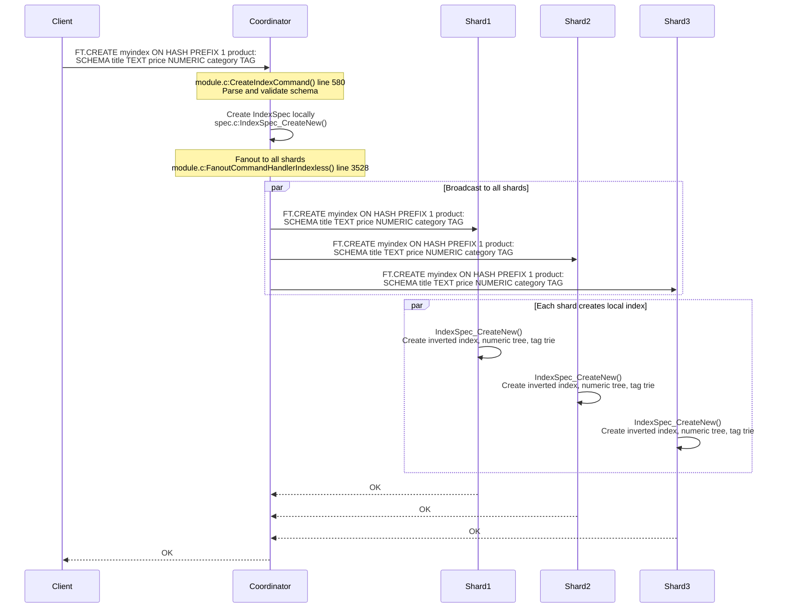
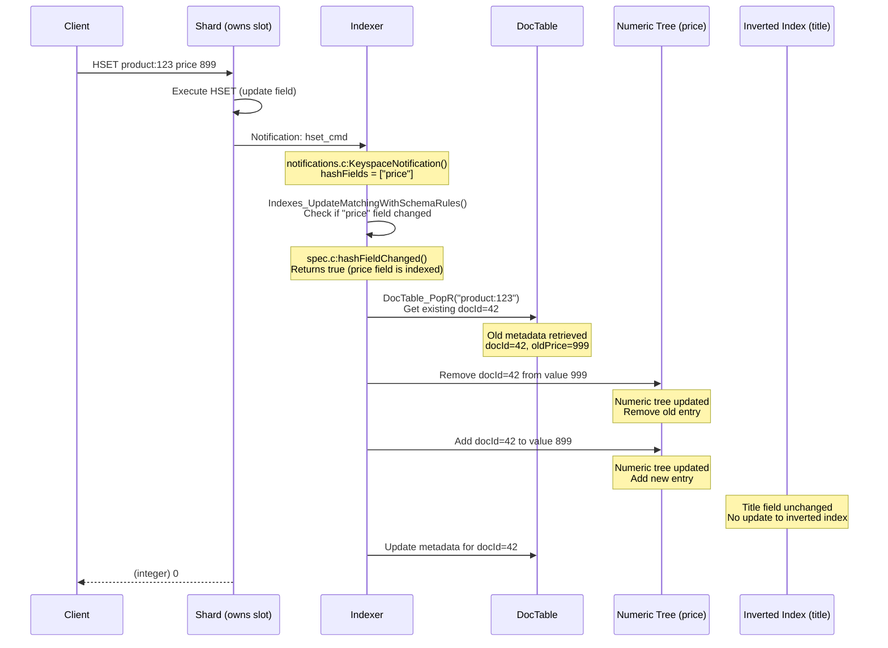
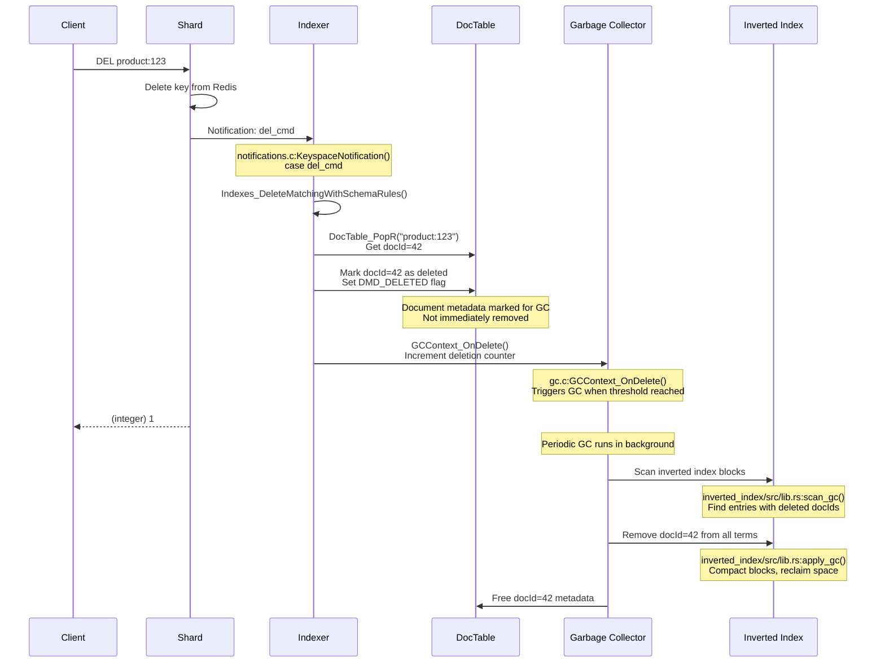
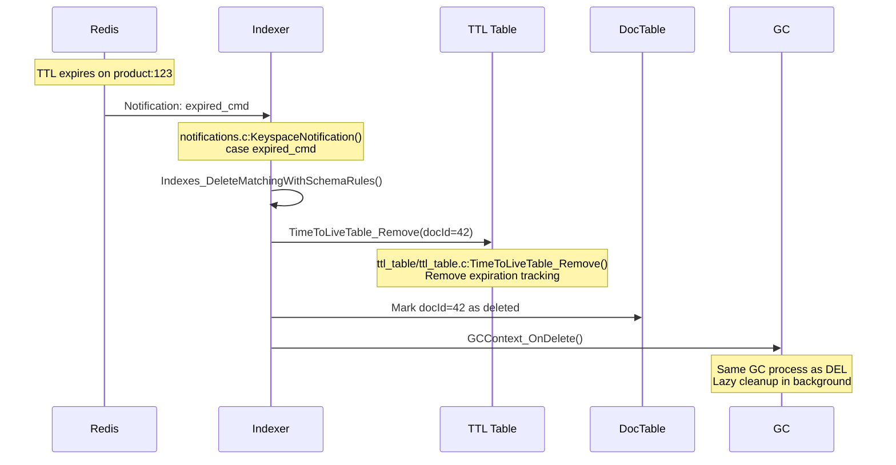
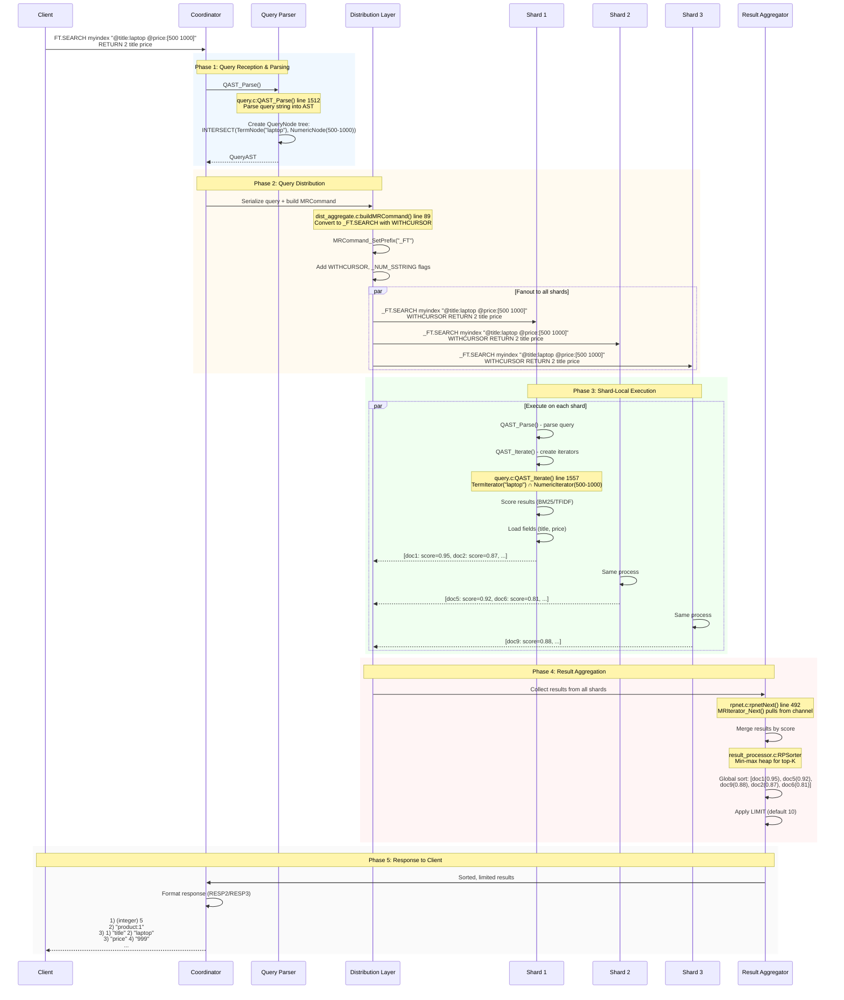
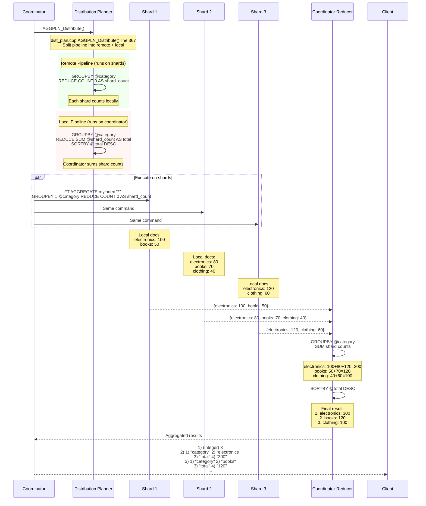
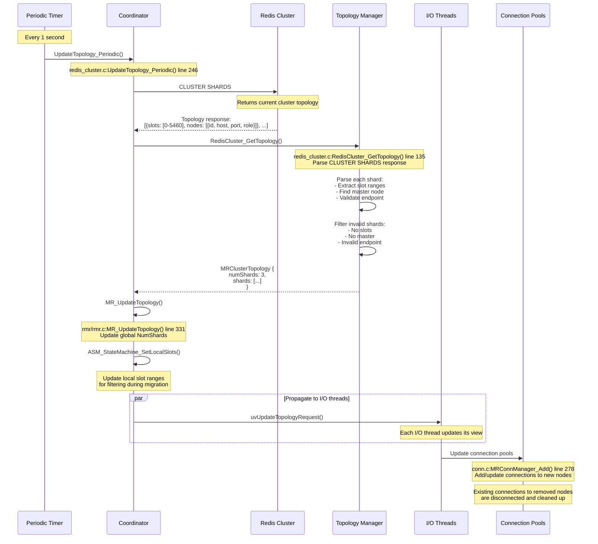
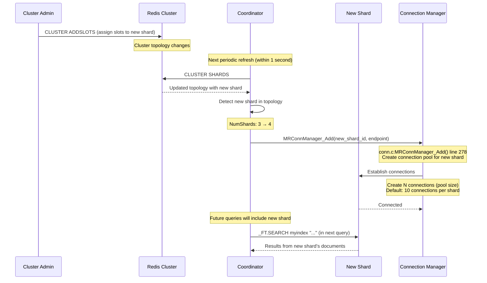
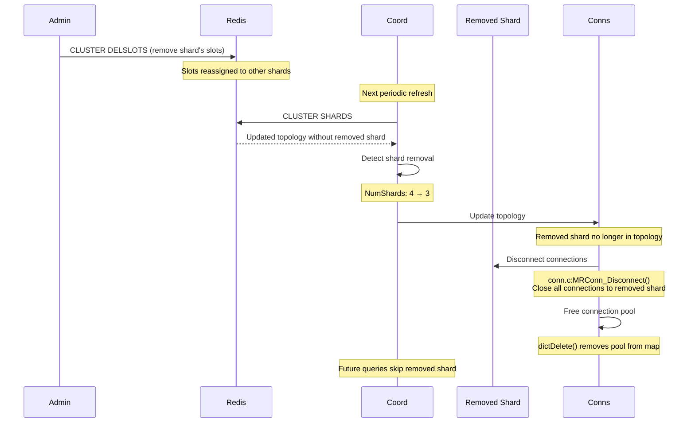
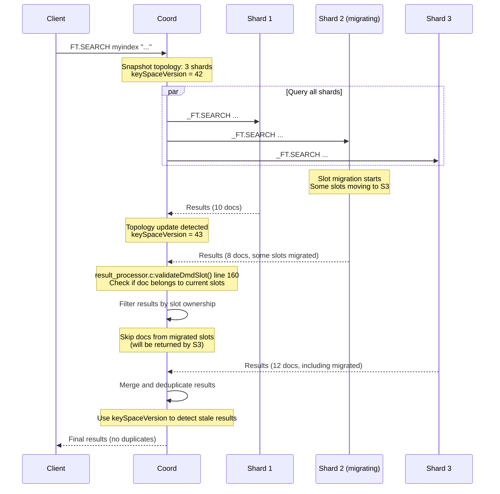

# RediSearch Distributed Cluster Mode (OSS Coordinator) - Comprehensive Walkthrough

This document provides a complete walkthrough of RediSearch in Distributed Cluster Mode using the OSS coordinator, covering the entire lifecycle from index creation through query execution to result return, including document change handling.

---

## Table of Contents

1. [Index Creation in Distributed Mode](#1-index-creation-in-distributed-mode)
2. [Document Indexing Lifecycle](#2-document-indexing-lifecycle)
   - 2.1 [New Document Added](#21-new-document-added)
   - 2.2 [Document Updated](#22-document-updated)
   - 2.3 [Document Deleted](#23-document-deleted)
   - 2.4 [Document Expired](#24-document-expired)
3. [Query Processing Lifecycle (Distributed)](#3-query-processing-lifecycle-distributed)
4. [Aggregation Query Example (FT.AGGREGATE)](#4-aggregation-query-example-ftaggregate)
5. [Cluster Topology Changes](#5-cluster-topology-changes)
   - 5.1 [Topology Discovery](#51-topology-discovery)
   - 5.2 [Shard Added](#52-shard-added)
   - 5.3 [Shard Removed](#53-shard-removed)
   - 5.4 [In-Flight Query Handling](#54-in-flight-query-handling)

---

## 1. Index Creation in Distributed Mode

### Command Example
```bash
FT.CREATE myindex ON HASH PREFIX 1 product: SCHEMA title TEXT price NUMERIC category TAG
```

This command creates an index named `myindex` that:
- Monitors HASH keys with prefix `product:`
- Indexes three fields:
  - `title` as full-text searchable TEXT
  - `price` as range-queryable NUMERIC
  - `category` as exact-match TAG

### Distributed Index Creation Flow



### Key Implementation Details

**File**: `src/module.c:CreateIndexCommand()` (line 580)
- Entry point for `FT.CREATE` command
- Parses schema definition and validates field types
- Creates `IndexSpec` structure with field specifications

**File**: `src/spec.c:IndexSpec_CreateNew()`
- Creates the index specification with schema rules
- Initializes data structures:
  - **Inverted Index**: For TEXT fields (term → document mappings)
  - **Numeric Range Tree**: For NUMERIC fields (binary tree for range queries)
  - **Tag Index**: For TAG fields (trie-based exact matching)
  - **DocTable**: Maps document keys to internal document IDs

**File**: `src/module.c:FanoutCommandHandlerIndexless()` (line 3528)
- Distributes the `FT.CREATE` command to all shards
- Uses `MR_Fanout()` to send identical command to each shard
- Waits for all shards to respond before returning to client

**Coordinator vs Shard Roles**:
- **Coordinator**:
  - Validates schema syntax
  - Maintains index metadata for query routing
  - Does NOT store actual indexed data
  - Coordinates distributed queries

- **Shards**:
  - Each shard creates identical index schema
  - Each shard maintains its own local index instance
  - Each shard only indexes documents in its hash slots
  - Shards execute queries independently on local data

**Schema Propagation**:
- Schema is propagated synchronously to all shards
- If any shard fails, the entire operation fails
- All shards must have identical schema definitions

---

## 2. Document Indexing Lifecycle

### 2.1 New Document Added

**Example**: `HSET product:123 title "laptop" price 999 category "electronics"`

When a new document is added to Redis, the following process occurs:

#### Hash Slot Calculation

Redis uses **CRC16** to calculate which shard owns a document:

```c
// Hash slot calculation (standard Redis cluster algorithm)
slot = CRC16("product:123") % 16384
```

- Redis has 16384 hash slots (0-16383)
- Each shard owns a range of slots (e.g., Shard 1: 0-5460, Shard 2: 5461-10922, Shard 3: 10923-16383)
- The document is automatically routed to the correct shard by Redis cluster

#### Indexing Process Details

**File**: `src/notifications.c:KeyspaceNotification()` (line 147)
- Redis triggers keyspace notifications for HSET commands
- RediSearch subscribes to these notifications

**File**: `src/spec.c:Indexes_UpdateMatchingWithSchemaRules()` (line 3958)
- Finds all indexes matching the key prefix
- Checks if `product:` matches the index's `PREFIX` rule

**File**: `src/indexer.c:IndexDocument()` (line 424)
- Assigns document ID via `DocTable_Put()` (line 173)
- Indexes TEXT fields → inverted index (`writeCurEntries()` at line 102)
- Indexes NUMERIC fields → numeric range tree (`numericIndexer()` in `src/document.c:799`)
- Indexes TAG fields → tag trie (`tagIndexer()` in `src/document.c:760`)

**Data Structures Updated**:
1. **DocTable** (`src/doc_table.c`): Maps `product:123` → `docId=42`
2. **Inverted Index** (`src/redis_index.c`): Term "laptop" → `[..., docId=42]`
3. **Numeric Tree** (`src/numeric_index.c`): Range tree node for 999.0 contains `docId=42`
4. **Tag Index** (`src/tag_index.c`): Trie node for "electronics" → `[..., docId=42]`

---

### 2.2 Document Updated

**Example**: `HSET product:123 price 899`



#### Update Process Details

**File**: `src/indexer.c:makeDocumentId()` (line 136)
- If `replace=true`, calls `DocTable_PopR()` to get existing document metadata
- Decrements index statistics for old document
- Removes old entries from vector and geometry indexes if present

**Optimization**: RediSearch only re-indexes **changed fields**:
- `hashFields` parameter contains list of modified fields
- `hashFieldChanged()` checks if any indexed field was modified
- Unchanged fields (like `title`) are not re-indexed

---

### 2.3 Document Deleted

**Example**: `DEL product:123`



#### Deletion Process Details

**File**: `src/notifications.c:KeyspaceNotification()` (line 184)
- `del_cmd` case calls `Indexes_DeleteMatchingWithSchemaRules()`

**File**: `src/spec.c:Indexes_DeleteMatchingWithSchemaRules()` (line 3988)
- Calls `IndexSpec_DeleteDoc()` for each matching index

**Lazy Deletion**: Documents are not immediately removed from indexes:
1. Document metadata is marked with `DMD_DELETED` flag
2. Deletion counter is incremented
3. Garbage collector runs periodically to clean up

**Garbage Collection** (`src/gc.c` and `src/fork_gc.c`):
- **Periodic GC**: Runs every few seconds (configurable interval)
- **Scan Phase**: Iterates through inverted index blocks
- **Cleanup Phase**: Removes deleted docIds, compacts blocks
- **Rust Implementation**: `src/redisearch_rs/inverted_index/src/lib.rs:scan_gc()` and `apply_gc()`

---

### 2.4 Document Expired

**Example**: Document with TTL expires



#### Expiration Details

**File**: `src/ttl_table/ttl_table.c`
- Tracks document and field-level expiration times
- `TimeToLiveTable_HasDocExpired()` checks if document expired (line 77)
- `TimeToLiveTable_VerifyDocAndFieldMask()` validates field expiration (line 122)

**Field-Level Expiration**: RediSearch supports per-field TTL:
- Hash fields can have individual expiration times
- Iterator validates field expiration during query execution
- Expired fields are filtered out from results

---

## 3. Query Processing Lifecycle (Distributed)

### Query Example
```bash
FT.SEARCH myindex "@title:laptop @price:[500 1000]" RETURN 2 title price
```

This query searches for documents where:
- `title` contains "laptop"
- `price` is between 500 and 1000
- Returns only `title` and `price` fields

### Complete Distributed Query Flow



### Phase-by-Phase Breakdown

#### Phase 1: Query Reception at Coordinator

**File**: `src/query.c:QAST_Parse()` (line 1512)

The coordinator parses the query string into an Abstract Syntax Tree (AST):

```c
// Query: "@title:laptop @price:[500 1000]"
// Becomes AST:
QueryNode {
  type: QN_PHRASE,  // Implicit AND
  children: [
    QueryNode {
      type: QN_TOKEN,
      field: "title",
      term: "laptop"
    },
    QueryNode {
      type: QN_NUMERIC,
      field: "price",
      min: 500,
      max: 1000
    }
  ]
}
```

**Dialect Support**: RediSearch supports two query dialects:
- **Dialect 1** (legacy): `RSQuery_ParseRaw_v1()`
- **Dialect 2** (current): `RSQuery_ParseRaw_v2()` - more features, better syntax

#### Phase 2: Query Distribution

**File**: `src/coord/dist_aggregate.c:buildMRCommand()` (line 89)

The coordinator prepares the query for distribution:

1. **Command Transformation**:
   - `FT.SEARCH` → `_FT.SEARCH` (internal command prefix)
   - Adds `WITHCURSOR` flag for pagination support
   - Adds `_NUM_SSTRING` flag for numeric encoding

2. **Serialization** (`src/coord/rmr/rmr.c:MR_Fanout()` line 301):
   - Creates `MRCommand` structure
   - Sets protocol version (RESP2 or RESP3)
   - Prepares slot info for each shard

3. **Fanout** (`src/coord/rmr/cluster.c:MRCluster_SendCommand()` line 41):
   - Sends identical command to all shards
   - Uses connection pool for each shard
   - Asynchronous I/O via libuv event loop

#### Phase 3: Shard-Local Execution

Each shard executes the query independently against its local index:

**Step 1: Parse Query** (`src/query.c:QAST_Parse()`)
- Same parsing logic as coordinator
- Creates identical AST

**Step 2: Create Iterators** (`src/query.c:QAST_Iterate()` line 1557)

The AST is converted to an iterator tree:

```c
// Iterator tree for "@title:laptop @price:[500 1000]"
IntersectIterator {
  children: [
    TermIterator("laptop"),      // Reads from inverted index
    NumericRangeIterator(500, 1000)  // Reads from numeric tree
  ]
}
```

**Iterator Types**:
- **TermIterator**: Reads docIds from inverted index for term "laptop"
- **NumericRangeIterator**: Reads docIds from numeric range tree for 500-1000
- **IntersectIterator**: Computes intersection of child iterators

**Step 3: Score Results**

**File**: `src/result_processor.c:RPScorer`

Each matching document is scored using:
- **BM25** (default): `score = IDF(term) * (TF * (k1 + 1)) / (TF + k1 * (1 - b + b * docLen/avgDocLen))`
- **TFIDF**: `score = TF * IDF`

**Step 4: Load Fields** (`src/result_processor.c:RPLoader`)
- Loads requested fields (`title`, `price`) from Redis hash
- Applies field-level expiration checks

**Step 5: Return Results**
- Shard returns top results with scores
- Uses cursor for pagination (WITHCURSOR)

#### Phase 4: Result Aggregation at Coordinator

**File**: `src/coord/rpnet.c:rpnetNext()` (line 492)

The coordinator aggregates results from all shards:

**Step 1: Collect Results** (`src/coord/rmr/rmr.c:MRIterator_Next()` line 891)
- `MRIterator` pulls results from channel
- Channel is populated by async callbacks from shards
- Results arrive in arbitrary order

**Step 2: Merge and Sort** (`src/result_processor.c:RPSorter` line 727)
- Uses **min-max heap** for efficient top-K selection
- Compares results by score (or custom sort fields)
- Maintains only top results (memory efficient)

**Step 3: Apply Limit**
- Default limit: 10 results
- Can be overridden with `LIMIT offset count`

**Error Handling**:
- If a shard fails, coordinator logs error
- Partial results returned if some shards succeed
- Timeout handling via `MRCtx_IsTimedOut()`

#### Phase 5: Response to Client

**File**: `src/module.c:DistSearchCommand()`

The coordinator formats the final response:

**RESP2 Format**:
```
1) (integer) 5              # Total results
2) "product:1"              # Document key
3) 1) "title"               # Field name
   2) "laptop"              # Field value
   3) "price"
   4) "999"
4) "product:5"
5) 1) "title"
   2) "laptop"
   3) "price"
   4) "899"
...
```

**RESP3 Format** (structured):
```
{
  "total_results": 5,
  "results": [
    {
      "id": "product:1",
      "title": "laptop",
      "price": "999"
    },
    ...
  ]
}
```

---

## 4. Aggregation Query Example (FT.AGGREGATE)

### Query Example
```bash
FT.AGGREGATE myindex "*" GROUPBY 1 @category REDUCE COUNT 0 AS total SORTBY 2 @total DESC
```

This query:
- Matches all documents (`*`)
- Groups by `category` field
- Counts documents in each category
- Sorts by count descending

### Distributed Aggregation Pipeline Flow



### Pipeline Distribution Details

**File**: `src/coord/dist_plan.cpp:AGGPLN_Distribute()` (line 367)

The distribution planner splits the aggregation pipeline:

#### Reducer Distribution Table

| Reducer | Remote (Shard) | Local (Coordinator) |
|---------|----------------|---------------------|
| **COUNT** | `COUNT` | `SUM` of shard counts |
| **SUM** | `SUM` | `SUM` of shard sums |
| **AVG** | `SUM` + `COUNT` | `SUM(sums) / SUM(counts)` |
| **MIN** | `MIN` | `MIN` of shard mins |
| **MAX** | `MAX` | `MAX` of shard maxes |
| **TOLIST** | `TOLIST` | `TOLIST` (concatenate) |
| **STDDEV** | `SUM`, `COUNT`, `SUM(x²)` | Calculate stddev from aggregates |
| **QUANTILE** | `RANDOM_SAMPLE(500)` | `QUANTILE` on combined samples |

**File**: `src/coord/dist_plan.cpp:distributeCount()` (line 181)
- Remote: `COUNT` → produces count per shard
- Local: `SUM(@shard_count)` → sums all shard counts

**File**: `src/coord/dist_plan.cpp:distributeAvg()` (line 294)
- Remote: `SUM(@field)` + `COUNT`
- Local: `SUM(@shard_sum) / SUM(@shard_count)` via APPLY step

**File**: `src/coord/dist_plan.cpp:distributeQuantile()` (line 248)
- Remote: `RANDOM_SAMPLE(@field, 500)` → 500 random samples per shard
- Local: `QUANTILE` on combined samples (approximation)

### GROUP BY Distribution

**File**: `src/coord/dist_plan.cpp:distributeGroupStep()` (line 108)

GROUP BY operations are distributed as follows:

1. **Remote GROUP BY**: Each shard groups its local documents
2. **Local GROUP BY**: Coordinator re-groups by same key, applying distributed reducers

Example:
```
Original: GROUPBY @category REDUCE COUNT 0 AS total

Remote:   GROUPBY @category REDUCE COUNT 0 AS shard_count
Local:    GROUPBY @category REDUCE SUM @shard_count AS total
```

### SORTBY Distribution

**File**: `src/coord/dist_plan.cpp:AGGPLN_Distribute()` (line 449)

- **If SORTBY appears before GROUPBY**: Pushed to shards (each shard sorts locally)
- **If SORTBY appears after GROUPBY**: Runs only on coordinator (global sort)

In our example, `SORTBY @total DESC` runs on coordinator after aggregating counts.

---

## 5. Cluster Topology Changes

### 5.1 Topology Discovery

**File**: `src/coord/rmr/redis_cluster.c:RedisCluster_GetTopology()` (line 135)



### Topology Discovery Details

**Periodic Refresh**: Every 1 second (`REFRESH_PERIOD` in `src/coord/rmr/redis_cluster.c:243`)

**CLUSTER SHARDS Response Format**:
```
[
  {
    "slots": [[0, 5460]],
    "nodes": [
      {"id": "abc123", "host": "127.0.0.1", "port": 7000, "role": "master"},
      {"id": "def456", "host": "127.0.0.1", "port": 7001, "role": "replica"}
    ]
  },
  {
    "slots": [[5461, 10922]],
    "nodes": [...]
  },
  ...
]
```

**Validation** (`src/coord/rmr/redis_cluster.c:191`):
- Shard must have at least one slot range
- Shard must have a master node with valid endpoint
- Invalid shards are filtered out

---

### 5.2 Shard Added

When a new shard is added to the cluster:



**Connection Pool Management** (`src/coord/rmr/conn.c:MRConnManager_Add()` line 278):
- Creates connection pool with configurable size (default: 10)
- Connections are established asynchronously
- Round-robin selection for load balancing

---

### 5.3 Shard Removed

When a shard is removed from the cluster:



---

### 5.4 In-Flight Query Handling

**File**: `src/coord/rmr/rmr.c:MRIterator` and `src/result_processor.c:validateDmdSlot()`



#### In-Flight Query Details

**Slot Validation** (`src/result_processor.c:validateDmdSlot()` line 160):
- Each result is validated against current slot ownership
- Documents from migrated slots are filtered out
- Prevents duplicate results during slot migration

**KeySpace Versioning**:
- Each topology change increments `keySpaceVersion`
- Query snapshots topology at start
- Results are validated against current topology
- Stale results are discarded

**Error Handling**:
- If a shard becomes unavailable during query, partial results are returned
- Coordinator logs warnings for failed shards
- Client receives best-effort results

---

## Summary

This walkthrough covered the complete lifecycle of RediSearch in Distributed Cluster Mode (OSS coordinator):

1. **Index Creation**: Schema propagation via fanout to all shards, each maintaining local index instances
2. **Document Indexing**: Hash slot-based routing, keyspace notifications, lazy deletion with GC
3. **Query Processing**: 5-phase distributed query execution with result aggregation
4. **Aggregation**: Pipeline distribution with reducer transformation (COUNT→SUM, AVG→SUM+COUNT, etc.)
5. **Topology Changes**: Periodic discovery, connection pool management, in-flight query handling

### Key Architectural Patterns

- **Fanout Pattern**: Coordinator broadcasts commands to all shards
- **Lazy Deletion**: Documents marked for deletion, cleaned up by periodic GC
- **Pipeline Distribution**: Aggregation pipelines split into remote (shard) and local (coordinator) phases
- **Slot-Based Routing**: Redis cluster hash slots determine document ownership
- **Result Merging**: Min-max heap for efficient top-K selection across shards
- **Topology Awareness**: Periodic refresh with connection pool updates

### Key Data Structures

- **IndexSpec**: Schema definition with field specifications
- **DocTable**: Document key → internal ID mapping
- **Inverted Index**: Term → document ID postings (Rust implementation)
- **Numeric Range Tree**: Binary tree for numeric range queries
- **Tag Index**: Trie-based exact-match indexing
- **MRCluster**: Cluster topology with shard endpoints and slot ranges
- **QueryAST**: Abstract syntax tree for parsed queries
- **Result Processors**: Chain of processors (iterator → scorer → sorter → loader → network)

### Key Files Reference

**Core Module**:
- `src/module.c`: Command handlers, fanout logic
- `src/spec.c`: Index specification management
- `src/indexer.c`: Document indexing pipeline
- `src/notifications.c`: Keyspace notification handling

**Coordinator**:
- `src/coord/rmr/redis_cluster.c`: Topology discovery
- `src/coord/rmr/rmr.c`: Fanout and result iteration
- `src/coord/rmr/conn.c`: Connection pool management
- `src/coord/dist_aggregate.c`: Distributed aggregation
- `src/coord/dist_plan.cpp`: Pipeline distribution
- `src/coord/rpnet.c`: Network result processor

**Query Processing**:
- `src/query.c`: Query parsing and iterator creation
- `src/result_processor.c`: Result processing chain
- `src/gc.c`: Garbage collection
- `src/redisearch_rs/inverted_index/src/lib.rs`: Rust inverted index implementation

---

**Document Version**: 1.0
**Last Updated**: 2026-02-06
**RediSearch Version**: Based on current codebase (C-to-Rust migration in progress)

